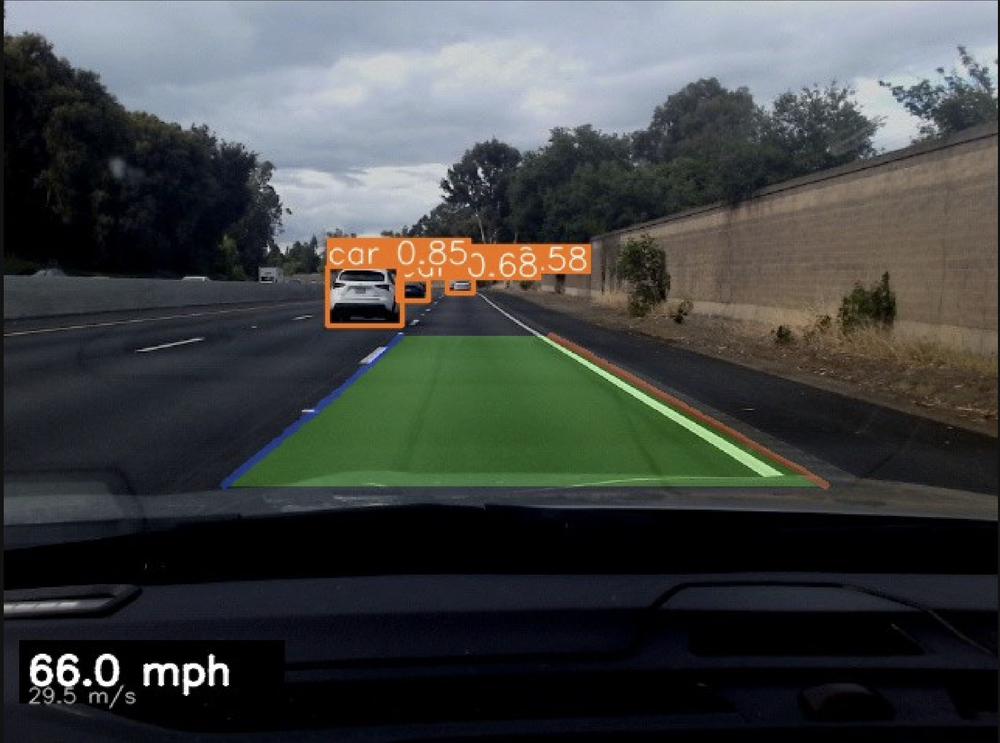
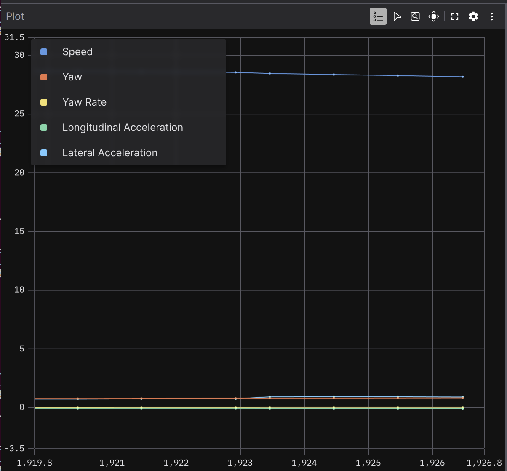

# roadrover

A ROS 2 Humble project for data collection, offline perception, lane detection, object detection, and ego state estimation, intended to run on a Raspberry Pi.

## Hardware

| Device | Default path |
|--------|-------------|
| USB camera | `/dev/video4` |
| GPS receiver (NMEA serial) | `/dev/ttyUSB0` |

## Prerequisites

- Ubuntu 22.04 with ROS 2 Humble installed
- The following ROS 2 packages available in your workspace or installed via apt:

```bash
sudo apt install ros-humble-usb-cam \
                 ros-humble-nmea-navsat-driver \
                 ros-humble-foxglove-bridge
```

> **Raspberry Pi note:** run the same apt command after installing ROS 2 Humble on the Pi.

## Setup

### 1. Clone the repository

```bash
mkdir -p ~/ros2_ws/src
cd ~/ros2_ws/src
git clone git@github.com:prasadshingne/roadrover.git
```

### 2. Build

```bash
cd ~/ros2_ws
source /opt/ros/humble/setup.bash
colcon build --symlink-install
```

### 3. Source the workspace

```bash
source ~/ros2_ws/install/setup.bash
```

Add this line to `~/.bashrc` to source automatically on every terminal:

```bash
echo "source ~/ros2_ws/install/setup.bash" >> ~/.bashrc
```

## Usage

### Launch everything

```bash
ros2 launch roadrover_bringup bringup.launch.py
```

This starts three nodes:

| Node | Package | Topic(s) |
|------|---------|----------|
| `usb_cam` | `usb_cam` | `/usb_cam/image_raw`, `/usb_cam/camera_info` |
| `nmea_navsat_driver` | `nmea_navsat_driver` | `/fix`, `/vel`, `/time_reference` |
| `foxglove_bridge` | `foxglove_bridge` | WebSocket on port **8765** |

### Visualize with Foxglove Studio

1. Open [Foxglove Studio](https://app.foxglove.dev) in a browser or the desktop app.
2. Click **Open connection** → **Foxglove WebSocket**.
3. Enter `ws://<device-ip>:8765` (use `ws://localhost:8765` if running locally).
4. Subscribe to `/usb_cam/image_raw` for camera feed and `/fix` for GPS.

## Recording and replay

### Record a session

```bash
ros2 launch roadrover_bringup record.launch.py
```

Starts all sensors and records the following topics to `~/roadrover_bags/session_<timestamp>/`:

| Topic | Content |
|-------|---------|
| `/usb_cam/image_raw` | Raw camera frames |
| `/usb_cam/image_raw/compressed` | Compressed camera frames |
| `/usb_cam/camera_info` | Camera calibration |
| `/fix` | GPS position (NavSatFix) |
| `/vel` | GPS velocity (TwistStamped) |
| `/time_reference` | GPS time |

Stop recording with **Ctrl-C**. The bag is fully written before the process exits.

### Replay a session

```bash
ros2 launch roadrover_bringup replay.launch.py bag_path:=/path/to/session_<timestamp>
```

Plays the bag back and starts foxglove_bridge on port 8765 so you can inspect it in Foxglove Studio. The `--clock` flag is passed automatically so nodes that use `/clock` stay in sync with the recorded timeline.

## Offline perception pipeline

`src/roadrover_perception/scripts/process_bag.py` reads an original recorded bag, runs the full perception stack, and writes a new bag:

```bash
# From the repo root (YOLOv8s weights must be present as yolov8s.pt)
python3 src/roadrover_perception/scripts/process_bag.py ~/roadrover_bags/session_<timestamp>

# Optionally specify the output path
python3 src/roadrover_perception/scripts/process_bag.py <bag> --output <out_bag>
```



### What it does

| Step | Detail |
|------|--------|
| Image rotation | All camera frames rotated 180° in-place |
| Object detection | YOLOv8s on GPU; detections in the car hood region are filtered out |
| Lane detection | Bird's-eye view (BEV) perspective warp + sliding window search; EMA-smoothed degree-2 polynomial per lane |
| Ego state estimation | Heading, yaw rate, longitudinal and lateral acceleration derived from GPS velocity |
| Map matching | GPS fix snapped to nearest OSM road edge; lane number estimated from GPS lateral offset + BEV measurement |
| Actor tracking | IoU tracker on YOLO vehicle detections; 3D box positions projected to ENU via bounding-box-height model |

### Output topics

| Topic | Type | Content |
|-------|------|---------|
| `/perception/image_annotated` | `CompressedImage` | YOLO boxes + lane overlay + speed |
| `/perception/actors` | `MarkerArray` | Tracked vehicle boxes (orange CUBEs) in ENU `map` frame; requires `--map-graph` |
| `/ego/odometry` | `nav_msgs/Odometry` | Heading (quaternion), speed, yaw rate |
| `/ego/imu` | `sensor_msgs/Imu` | Yaw rate, longitudinal accel, lateral accel |
| `/ego/matched_fix` | `NavSatFix` | GPS snapped to estimated lane centre |
| `/ego/lane_info` | `String` | Road name, lane number, method, GPS offset, BEV offset |
| `/ego/marker` | `Marker` (CUBE) | Car-box in ENU `map` frame, yaws with heading |
| `/ego/pose` | `PoseStamped` | Ego pose in `map` frame |
| `/map/lanes` | `MarkerArray` | Lane boundary LINE_STRIP markers in ENU `map` frame (cyan = interior, white = edge, yellow = centreline) |
| `/tf` | `TFMessage` | `map → base_link` transform per GPS fix |

### Ego state signals

All signals are derived from the GPS `/vel` topic (no IMU on this rover):

| Signal | Source | Method |
|--------|--------|--------|
| Heading | `/vel` east/north components | `atan2(vy_north, vx_east)` |
| Yaw rate | Heading | Finite diff + EMA smoothing |
| Longitudinal accel | Speed | `d(speed)/dt` + EMA |
| Lateral accel | Speed + yaw rate | `speed × yaw_rate` (centripetal) |

### Map matching and lane localization

Pass `--map-graph` to enable map matching. The graph is produced by `make_map.py` (see [OSM map pipeline](#osm-map-pipeline) below).

```bash
python3 src/roadrover_perception/scripts/process_bag.py ~/roadrover_bags/session_<timestamp> \
    --map-graph ~/roadrover_bags/map_graph.pkl
```

The localization runs in two stages per GPS fix:

1. **GPS snap** — the raw fix is projected onto the nearest OSM road edge to get the road position along the route. On divided highways `ox.nearest_edges()` can return the opposing carriageway; if the nearest edge's tangent strongly opposes ego heading (dot product < −0.3), the matcher searches all edges within 30 m for the closest heading-consistent alternative (dot > 0.3) and uses that instead.

2. **Lane-centre placement** — the snap point is EMA-smoothed (α = 0.6) to absorb GPS-fix jitter, then offset laterally to the detected lane centre using:

   ```
   ego_x = snap_x + (N − lane_num + 0.5) × LANE_WIDTH × sin(heading)
   ego_y = snap_y − (N − lane_num + 0.5) × LANE_WIDTH × cos(heading)
   ```

   `lane_num` (1 = rightmost) is estimated from the BEV camera's `bev_d_left` measurement (distance in metres to the ego's left lane boundary), EMA-smoothed with α = 0.10 and a 4-fix hysteresis counter to prevent transient jumps.

The `/ego/lane_info` string topic reports `road | lane k/N [method] | gps_offset ±X m | bev_d_left Y m` for every GPS fix.

> **Why not use raw GPS for the lateral position?**  GPS lateral accuracy on a motorway is typically 5–15 m — far worse than a lane width — due to multipath reflections from trees, bridges, and nearby structures.  In recorded sessions the GPS antenna reported a position ~10 m west of the ego's actual lane, placing it in the median when converted directly to ENU.  The OSM snap point reliably tracks the road regardless of this lateral error and is the correct base for lane-level positioning. **Do not replace the snap + offset formula with raw GPS coordinates.**

### Viewing in Foxglove



Open the processed bag in Foxglove Studio (File → Open local file). Useful panel configurations:

- **Image** panel → `/perception/image_annotated` — annotated video with lanes and YOLO boxes
- **Map** panel → `/fix` — GPS track on a satellite map
- **3D** panel → add topics `/map/lanes` (lane boundaries), `/ego/marker` (ego car box), and `/perception/actors` (detected vehicle boxes); set **Display frame** to `base_link` to follow the ego
- **Raw messages** panel → `/ego/lane_info` — live road/lane diagnostics
- **Plot** panel — add series for time-series signals:

| Signal | Topic | Field path |
|--------|-------|------------|
| Speed (m/s) | `/ego/odometry` | `twist.twist.linear.x` |
| Yaw rate (rad/s) | `/ego/odometry` | `twist.twist.angular.z` |
| Longitudinal accel | `/ego/imu` | `linear_acceleration.x` |
| Lateral accel | `/ego/imu` | `linear_acceleration.y` |

> **Foxglove 3D tip:** the TF visualizer draws a connection line between the `map` origin and `base_link`. To hide it, open the panel settings → **Transforms** → uncheck **Show connection lines**.

### Known limitation: 3D actor position noise

The orange actor boxes in the 3D view will visibly jitter. This is expected and has two root causes:

**1. Monocular depth estimation is noisy.** Distance is inferred from bounding-box height using a pinhole model (`d = f × H / h_px`). YOLO's detection boundaries shift 5–15% frame-to-frame even for a stationary vehicle. At 40 m range, a 10% height variation translates to ±4 m of distance error per frame — with no depth sensor to correct it, this noise is irreducible.

**2. GPS anchor discontinuity.** Ego position is updated at 1 Hz from GPS and dead-reckoned between fixes using NMEA velocity. Each GPS fix carries a new lateral error (motorway GPS accuracy is ±5–15 m). When the map-matched ego position shifts at a fix boundary, all actor ENU positions shift by the same amount simultaneously, appearing as a periodic snap in the 3D view.

**Why not fix it?** Eliminating this properly requires hardware this rover doesn't have: a stereo camera or LiDAR for metric depth, or a radar for accurate radial distance. The tracking *identity* (which box belongs to which vehicle across frames) is correct — only the absolute 3D position estimate is noisy. Sensor fusion with any of those modalities would replace the bounding-box-height heuristic and solve both issues.

### Lane detection debug tool

Inspect the BEV pipeline on a single frame without running the full bag:

```bash
python3 src/roadrover_perception/scripts/debug_lanes.py <bag_path> --frame 50 --out-dir /tmp/lane_debug
```

Output images in `/tmp/lane_debug/`:

| File | Content |
|------|---------|
| `0_original.jpg` | Raw rotated frame |
| `1_clahe.jpg` | CLAHE-enhanced grayscale |
| `2_edges.jpg` | Canny edges |
| `3_roi.jpg` | Trapezoid ROI boundary |
| `4_masked_edges.jpg` | Edges inside ROI |
| `5_bev_edges.jpg` | Edges warped to bird's-eye view |
| `6_bev_windows.jpg` | Sliding windows in BEV |
| `7_bev_fit.jpg` | Polynomial fit in BEV |
| `8_lane_overlay.jpg` | Lanes warped back to image space |

## OSM map pipeline

Before running map matching, generate the road network for a recorded session:

```bash
# 1. Download OSM road network and build lane geometry
python3 src/roadrover_perception/scripts/make_map.py ~/roadrover_bags/session_<timestamp>
```

This reads the `/fix` GPS track from the bag, downloads the matching OSM road graph, and writes three files to the bag's parent directory:

| File | Content |
|------|---------|
| `map.geojson` | Road centrelines — drag onto Foxglove **Map** panel |
| `lanes.geojson` | Lane boundary lines — consumed by `process_bag.py` for `/map/lanes` markers |
| `map_graph.pkl` | Pickled osmnx graph — passed to `process_bag.py` via `--map-graph` |

Lane boundaries are computed per OSM edge using `shapely.offset_curve`. For one-way roads the lanes are intended to be centred on the OSM edge, but for tightly-curved geometries the left-side offset curves can collapse; in practice all lane markers extend to the **right** of the OSM edge. Bidirectional roads split lanes left and right of the centreline. The ego positioning formula in `process_bag.py` is calibrated to this "OSM edge = left road boundary" convention.

```bash
# 2. (Optional) Generate OpenDRIVE for simulation
python3 src/roadrover_perception/scripts/make_xodr.py ~/roadrover_bags/map_graph.pkl
# → ~/roadrover_bags/map.xodr
# Verify: esmini --odr map.xodr --window 60 60 1200 800
```

Each OSM edge is split into per-polyline-segment roads so curves are preserved. For one-way roads the reference line is shifted to the carriageway's left edge so that the outermost (rightmost) lane centre aligns with the ego position written by `process_bag.py`. Bidirectional roads split lanes symmetrically around the OSM centreline.

## Scenario extraction

Extract an OpenSCENARIO 1.x scenario from a processed bag. The ego trajectory comes from `/ego/pose`; actors are detected with YOLOv8s and tracked across frames using IoU matching.

```bash
python3 src/roadrover_perception/scripts/make_scenario.py \
    ~/roadrover_bags/session_<timestamp>_processed \
    --map-graph ~/roadrover_bags/map_graph.pkl \
    --out-dir ~/roadrover_bags/scenario_out
```

This writes two files to `--out-dir`:

| File | Content |
|------|---------|
| `map.xodr` | OpenDRIVE road network (auto-generated via `make_xodr.py`) |
| `scenario.xosc` | OpenSCENARIO 1.x file — ego + detected actor trajectories |

The processed bag must have been produced by `process_bag.py --map-graph` (requires `/ego/pose` topic).

**Actor detection pipeline:**

1. Re-run YOLOv8s on `/perception/image_annotated` frames (vehicle classes: car, motorcycle, bus, truck)
2. Track detections across frames with greedy IoU matching (`IOU_THRESHOLD=0.30`)
3. Project each bounding-box bottom-centre to ENU via a pinhole road-plane model
4. Export tracks with ≥ 10 qualifying frames (configurable via `--min-track-frames`)

**Verify in esmini:**

```bash
cd ~/roadrover_bags/scenario_out
esmini --osc scenario.xosc --window 60 60 1200 800
```

## Changing device paths

If your camera or GPS receiver is on a different device node, edit the parameters in
[src/roadrover_bringup/launch/bringup.launch.py](src/roadrover_bringup/launch/bringup.launch.py):

```python
# Camera
'video_device': '/dev/video4',   # change to your device, e.g. /dev/video0

# GPS
'port': '/dev/ttyUSB0',          # change to your device, e.g. /dev/ttyUSB1
'baud': 4800,                    # change if your receiver uses a different baud rate
```

Rebuild after any changes:

```bash
colcon build --symlink-install --packages-select roadrover_bringup
```

## Troubleshooting

**Camera not found**
```bash
v4l2-ctl --list-devices
```
Find your camera and update `video_device` accordingly.

**GPS not found**
```bash
ls /dev/ttyUSB*
```
Update `port` accordingly. You may also need to add yourself to the `dialout` group:
```bash
sudo usermod -aG dialout $USER   # log out and back in after this
```

**Cannot open Foxglove connection**
- Confirm the bridge is running: `ros2 node list | grep foxglove`
- Check that port 8765 is not blocked by a firewall.

## License

Apache-2.0
